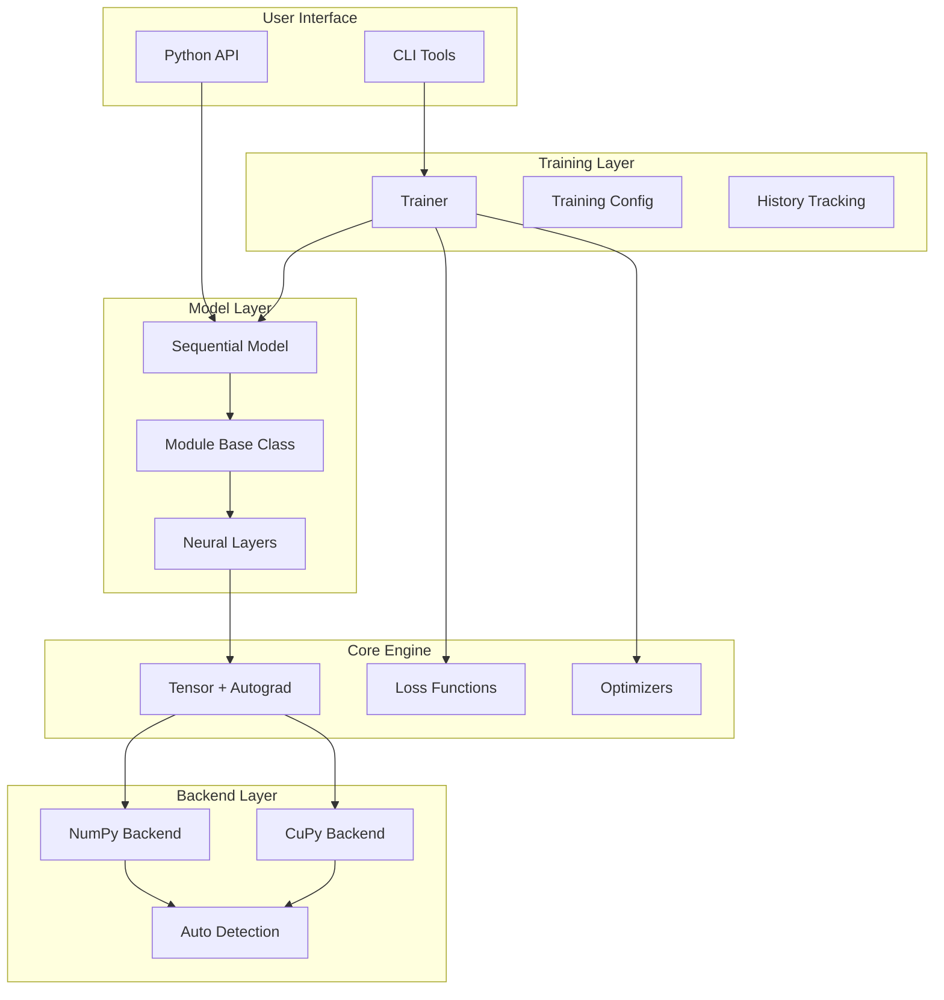
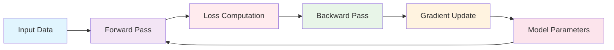

# NNFS: Neural Network From Scratch

<div align="center">

**A clean, educational deep learning framework built from scratch**  
Built with ❤️ using PyTorch-style API for learning how deep learning works under the hood

</div>

---

## ✨ Features

<div align="center">

| 🧠 **Neural Network Layers** | ⚡ **Automatic Differentiation** | 🎯 **Activation Functions** |
|------------------------------|----------------------------------|------------------------------|
| Dense, Conv2D, Pooling, Dropout | Complete autograd engine | ReLU, Sigmoid, Tanh, Softmax |

| 💪 **Loss Functions** | 🚀 **Optimizers** | 📊 **Training Utilities** |
|----------------------|-------------------|---------------------------|
| BCE, CrossEntropy, MSE | SGD, Adam | Trainer, metrics, history |

| 🔧 **Backend Support** | 🖥️ **CLI Tools** | 📈 **Visualization** |
|----------------------|-------------------|------------------------|
| NumPy/CuPy (GPU) | Training & benchmarking | Progress tracking |

</div>

---

## 🚀 Quick Start

### Installation

```bash
# Clone the repository
git clone https://github.com/yourusername/nnfs.git
cd nnfs

# Install in development mode
pip install -e .

# Or install with optional dependencies
pip install -e ".[dev]"      # Development tools
pip install -e ".[dashboard]" # Dashboard utilities
pip install -e ".[gpu]"       # GPU support (CuPy)
```

### Basic Usage

```python
import nnfs
from nnfs import Sequential, Dense, ReLU, Sigmoid
from nnfs.optim import SGD
from nnfs.utils import make_xor

# 🎯 Create dataset
X, y = make_xor(1000)

# 🏗️ Build model
model = Sequential(
    Dense(2, 64),
    ReLU(),
    Dense(64, 32),
    ReLU(),
    Dense(32, 1),
    Sigmoid()
)

# ⚙️ Setup training
optimizer = SGD(list(model.parameters()), lr=0.1)
loss_fn = nnfs.BCELoss()

# 🚀 Train
for epoch in range(100):
    output = model(X)
    loss = loss_fn(output, y)
    
    optimizer.zero_grad()
    loss.backward()
    optimizer.step()
    
    if epoch % 10 == 0:
        print(f"Epoch {epoch}, Loss: {loss.data:.4f}")
```

### Using the Trainer

```python
from nnfs.core import Trainer, TrainerConfig

# ⚙️ Setup trainer
config = TrainerConfig(
    epochs=100,
    batch_size=32,
    learning_rate=0.1,
    log_interval=10
)

trainer = Trainer(model, loss_fn, optimizer, config)

# 🏋️ Train with validation
history = trainer.fit(X_train, y_train, X_val, y_val)

# 📊 Evaluate
train_loss, train_acc = trainer.evaluate(X_train, y_train)
test_loss, test_acc = trainer.evaluate(X_test, y_test)
```

---

## 🖥️ Command Line Interface

<div align="center">

```bash
# Train a model on XOR dataset
nnfs-train --dataset xor --epochs 100 --lr 0.1

# Train on binary classification
nnfs-train --dataset binary --epochs 50 --hidden-size 128

# Benchmark model performance
nnfs-benchmark --backends numpy --epochs 20

# Show system information
nnfs-info
```

</div>

---

## 🏗️ Architecture

### System Architecture

<div align="center">



</div>

### Core Components

<div align="center">

| Component | Description | Key Features |
|-----------|-------------|--------------|
| **🧠 Tensor Engine** | Automatic differentiation | Dynamic graphs, gradient accumulation |
| **🏗️ Module System** | Neural network building blocks | Parameter registration, hooks |
| **⚡ Backend Abstraction** | Pluggable compute backends | NumPy/CuPy, auto-detection |
| **🎯 Training System** | High-level training API | Metrics, validation, persistence |

</div>

### Data Flow

<div align="center">



</div>

---

## 📚 Examples

<div align="center">

| Example | Description | Complexity |
|---------|-------------|------------|
| **`xor.py`** | Classic XOR problem | ⭐ Beginner |
| **`binary_classification.py`** | Binary classification | ⭐⭐ Intermediate |
| **`mnist_mlp.py`** | Multi-layer perceptron | ⭐⭐⭐ Advanced |
| **`cnn_example.py`** | Convolutional neural network | ⭐⭐⭐⭐ Expert |

</div>

---

## 🧪 Testing

<div align="center">

```bash
# Run all tests
python -m unittest discover -s tests

# Run specific test file
python -m unittest tests.test_ncfs_library

# Run with verbose output
python -m unittest discover -s tests -v
```

</div>

**Test Coverage:**
- ✅ Tensor operations and autograd
- ✅ Neural network layers  
- ✅ Loss functions and optimizers
- ✅ Training pipeline
- ✅ CLI functionality
- ✅ Integration tests

---

## 📊 Performance

<div align="center">

| Model Size | Parameters | Forward (ms) | Backward (ms) | Epoch (s) |
|------------|------------|--------------|---------------|-----------|
| **Small** | 273 | 0.12 | 0.28 | 0.018 |
| **Medium** | 5,185 | 0.45 | 1.02 | 0.067 |
| **Large** | 20,353 | 1.78 | 4.01 | 0.263 |

*Benchmark results on XOR classification (1000 samples)*

</div>

---

## 🤝 Contributing

<div align="center">

### Development Setup

```bash
# Clone repository
git clone https://github.com/yourusername/nnfs.git
cd nnfs

# Install development dependencies
pip install -e ".[dev]"

# Run tests
python -m unittest discover -s tests

# Run linting (if configured)
flake8 nnfs/
```

### Guidelines

- 🎯 Follow PEP 8 style guidelines
- 🧪 Add tests for new features  
- 📚 Update documentation as needed
- 🎓 Keep the educational focus - clarity over complexity

</div>

---

## 📖 Learning Resources

<div align="center">

| Resource | Type | Level |
|----------|------|-------|
| **[Neural Networks and Deep Learning](http://neuralnetworksanddeeplearning.com/)** | Book | 🎓 Beginner |
| **[Deep Learning](https://www.deeplearningbook.org/)** | Textbook | 🎓🎓 Intermediate |
| **[PyTorch Documentation](https://pytorch.org/docs/)** | Docs | 🎓🎓🎓 Advanced |

</div>

---

## 📄 License

<div align="center">

This project is licensed under the **MIT License** - see the [LICENSE](LICENSE) file for details.

</div>

---

## 🙏 Acknowledgments

<div align="center">

- 🎨 Inspired by PyTorch's elegant API design
- 🔢 Built with NumPy for numerical computations  
- 🚀 Educational framework based on deep learning fundamentals

</div>

---

<div align="center">

**NNFS** - Building understanding from the ground up 🚀

*Educational • Transparent • Extensible*

</div>
